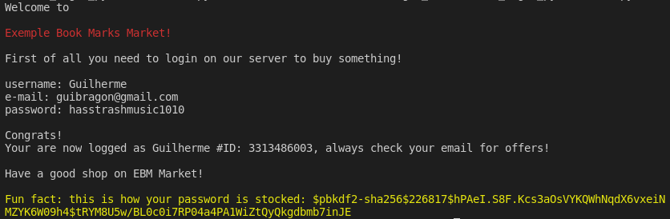

# (Very) Basic Account Login Using Python 
> Create a fictitious account with no limit of letters or characters to log into a fictitious site then see how your password would be stored in a database either!

Log in with a dummy account and see how your password would be stored.



## Installation

1. Install the Visual Studio Code app from Microsoft;

2. Download the .zip file from the repository, clicking on "Code" and then on "Download zip";

3. Extract the file in the folder where it was installed and open Visual Studio Code;

4. With the application open, click on "File", then "Open Folder", and select the location where the zip file was downloaded;

5. Open the folder, click on "main.py" and then on the play button in the upper right corner.

## Utility

This project is intended to be a basic demo.

Contain a very important utility in websites or applications, a account login function.

Use as a basis for your project or draw conclusions from the project!

If you want, add frameworks like Django or Boosttrap in a project with a HTML structure and then use this code as a base to build a function where you can log in and out.

## Virtual Enviroment

Need to have this two Python language libraries:

* random
* passlib

To make it possible, open cmd on your computer and type:

```
pip install random
```
```
pip install passlib
```

## Patch notes

* 0.1.0 (08/02/2022)
    * Projeto relançado
    * CHANGE: TypeHinting added to project
    * CHANGE: Clean code, organized project
    * CHANGE: README.md file changed

## Meta

Guilherme Bracero Gonzales - [@bracerin](https://twitter.com/bracerin) - guibragon@gmail.com

Distributed for free, provided credits are given
[https://github.com/BraceroInSabot](https://github.com/BraceroInSabot)